 
# MATLAB/Simulink Model for Sensorless FOC with SMO and Field Weakening: MCLV-48V-300W Motor Control Development Board and dsPIC33CH512MP508 MC DIM 

## 1. INTRODUCTION

This document describes the setup requirements to drive a PMSM motor on the hardware platform 
[EV18H47A](https://www.microchip.com/en-us/development-tool/EV18H47A) "MCLV-48V-300W Motor Control Development Board" and [EV76L31A](https://www.microchip.com/en-us/development-tool/EV76L31A) "dsPIC33CH512MP508 Motor Control Dual In-line Module(DIM)".

The MATLAB/Simulink model includes Sensorless Field Oriented Control (FOC) with Sliding Mode Observer (SMO) Estimator referenced from [AN1078](https://www.microchip.com/en-us/application-notes/an1078) “Sensorless Field Oriented Control of a PMSM”. It also includes field weakening algorithm to support extended speed operation. 

## 2.	SUGGESTED DEMONSTRATION REQUIREMENTS
### 2.1 MATLAB Model Required for the Demonstration
-  MATLAB/Simulink model can be downloaded as zip file ([link](https://github.com/microchip-pic-avr-solutions/matlab-mclv48v300w-33ch512mp508-pmsm-foc-smo)).

### 2.2	Software Tools Used for Testing the MATLAB/Simulink Model
1.	MPLAB X IDE and IPE (v6.20)
2.	XC-DSC compiler (v3.20)
3.	MATLAB R2024b
4.	Required MATLAB add-on packages
    -	Simulink (v24.2)
    -	Simulink Coder (v24.2)
    -	Stateflow (v24.2)
    -	MATLAB Coder (v24.2)
    -	Embedded Coder (v24.2)
    -	MPLAB Device blocks for Simulink (v3.59)
    - Motor Control Blockset (v24.2)

> **_NOTE:_**
>The software used for testing the model during release is listed above. It is recommended to use the version listed above or later versions for building the model.

### 2.3	Hardware Tools Required for the Demonstration
- MCLV-48V-300W Motor Control Development Board ([EV18H47A](https://www.microchip.com/en-us/development-tool/EV18H47A))
- dsPIC33CH512MP508 Motor Control DIM ([EV76L31A](https://www.microchip.com/en-us/development-tool/EV76L31A))
- 24V Power Supply ([AC002013](https://www.microchipdirect.com/dev-tools/AC002013)) 
- 24V, 3-Phase Brushless DC Permanent Magnet Hurst Motor ([AC300022](https://www.microchip.com/en-us/development-tool/AC300022))

> **_NOTE:_**
>All items listed under this section Hardware Tools Required for the Demonstration are available at [microchip DIRECT](https://www.microchipdirect.com/).

  
## 3. HARDWARE SETUP
This section describes hardware setup required for the demonstration.

1. 
 Connect the 3-phase wires from the motor to PHA, PHB and PHC of the J4 connector, provided on the MCLV-48V-300W Development Board.

    

    

    
2. Insert the **dsPIC33CH512MP508 Motor Control DIM** into the DIM Interface **connector J8** on the MCLV-48V-300W Development Board. Make sure the DIM is placed correctly and oriented before going ahead.

     

     

4. Plug the 24V power supply to **connector J1** on the MCLV-48V-300W Development Board. Alternatively, the Development Board can also be powered through connector J3.
      

      

 

 5. The board has an onboard programmer **PICkit™ On Board (PKoBv4)** , which can be used for programming or debugging the microcontroller or dsPIC DSC on the DIM. To use the onboard programmer, connect a micro-USB cable between the Host PC and **connector J16** on the MCLV-48V-300W Development Board.
      

     

 6. Alternatively, connect the Microchip programmer/debugger MPLAB® PICkit™ 5 In-Circuit Debugger between the Host PC used for programming the device and the **ICSP header J9** on the MCLV-48V-300W Development Board (as shown). Ensure that PICkit 4 is oriented correctly before proceeding.
      

       

 
  

## 4.	BASIC DEMONSTRATION

 Follow the below instructions step-by-step, to set up and run the motor control demo application:

1. Launch MATLAB (refer the section [“2.2 Sofware Tools Used for Testing the MATLAB/Simulink Model"](#22-software-tools-used-for-testing-the-matlabsimulink-model)).
 
2. Open the folder downloaded from the repository, in which MATLAB files are saved (refer the section ["2.1 MATLAB Model Required for the Demonstration"](#21-matlab-model-required-for-the-demonstration)).

    

    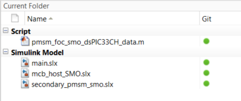

    > **_NOTE:_**
    >The dsPIC33CH512MP508 is a dual core  dsPIC DSC with a main core and a secondary core. Two independent Simulink models are created for these two cores to support the dual core architecture. These two models need to be build separately in the Simulink and programmed to the device once.
    
    | File Name |   Description| 
    | :--------:| :-----------:|
    | pmsm_foc_smo_dsPIC33CH_data.m |MATLAB Script with Motor and Inverter paramerters| 
    | main.slx   | Main Core Simulink Model  | 
    | secondary_pmsm_smo.slx   | Secondary Core Simulink Model | 
    | mcb_host_SMO.slx  | Simulink Model for Data Visualization |
        
3.	
Follow the steps below to configure and build the secondary core model. This model contains the SMO based sensorless FOC algorithm.

    1. 
 Double click and open the .m file. This .m file contains the configuration parameter for the motor and board. By default, the .m file is configured to run Hurst 300 motor and MCLV-48V-300W Development board. Run the file by clicking the <b>“Run”</b> icon and wait till all variables gets loaded on the <b>‘Workspace’</b> tab.

        

         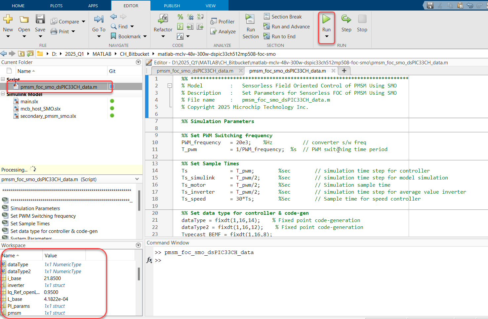

        

    2. 
Double click on the Sensorless FOC Simulink model.

        

        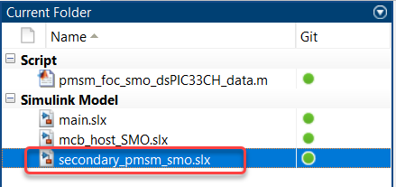

        

    3. 
This opens the Simulink model as shown below. Click on the <b>"Run"</b> icon to start the simulation.

        

        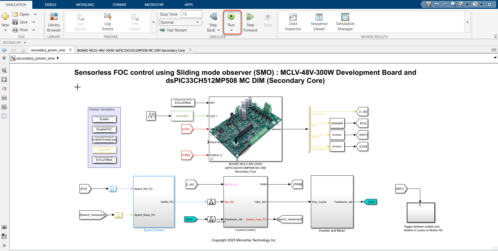

        

    4. 
To plot the simulation result, <b>Data Inspector</b> is used (refer to figure below). To observe the additional signals, log them as required. Alternatively, normal Simulink Scope can be used to plot the signals.

        

        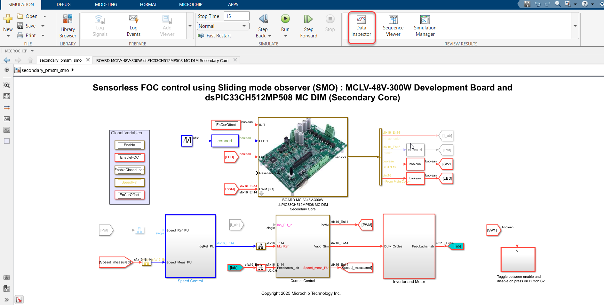

        

        > **_NOTE:_**
        >The Simulation is only possible on each core independentely.

    5. 
From this Simulink model an MPLAB X project can be generated, and it can be used to run the PMSM motor using Development board. 
To generate the code from the Simulink model, go to the <b>"MICROCHIP"</b> tab, and enable the tabs shown in the figure below. 

        

        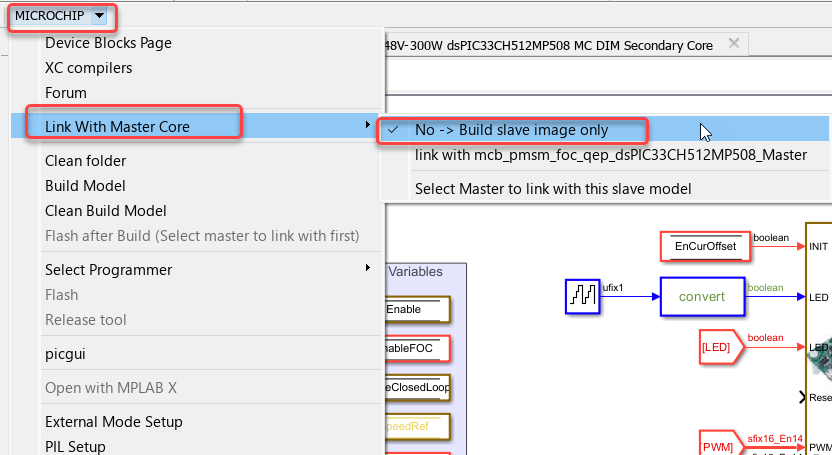

        

    6. To generate the code, click on <b>‘Build’</b> option under the <b>“Microchip”</b> tab and in <b>'Build, Deploy & Start'</b> menu. 

        

        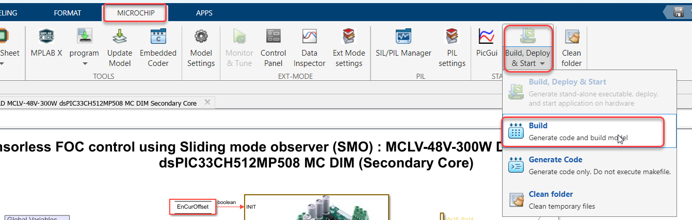

        

    7. 
After completing the process, the <b>‘Build process completed successfully’</b> message will be displayed on the <b>‘Diagnostics Viewer’</b>. 

        

        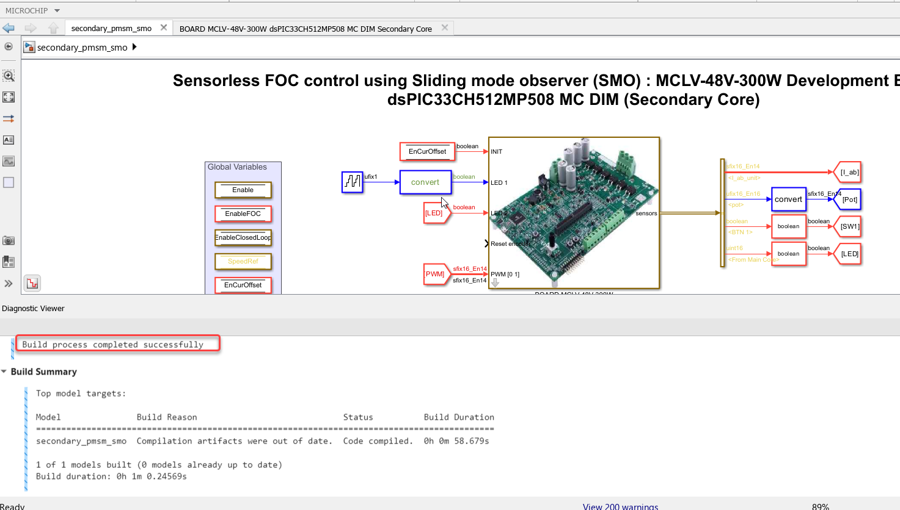

        

    
    8. 
 This will generate the MPLAB X project for the secondary core model and create the secondary image (.s file) which will be used in the main core model. This secondary image will be inside the <b>'secondary_image'</b> folder in the .X file 

        

        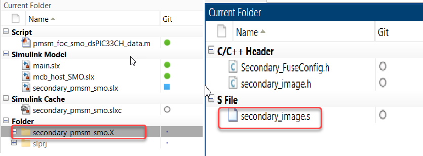

        

4.	
Follow the steps below to configure and build the main core model and program the device. This model contains the LED blinking and secondary core interface feature.

    1. 
Double click on the main core Simulink model.

        

        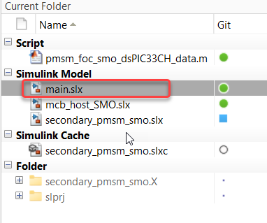

        

    2. 
This opens the Simulink model as shown below. From this Simulink model an MPLAB X project can be generated, and it can be used to run the PMSM motor using Development board.

        

        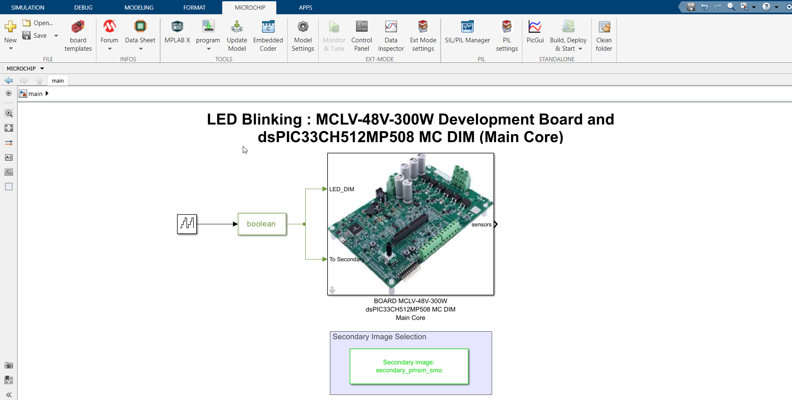

        

    3. 
Double click on the Secondary image block to select the secondary image. Click on the <b> 'Select secondary core image'</b> from the drop down option. Select the secondary core image <b>"secondary_image.s"</b> from the path <b>secondary_pmsm_smo.X/secondary_image</b>.

        

        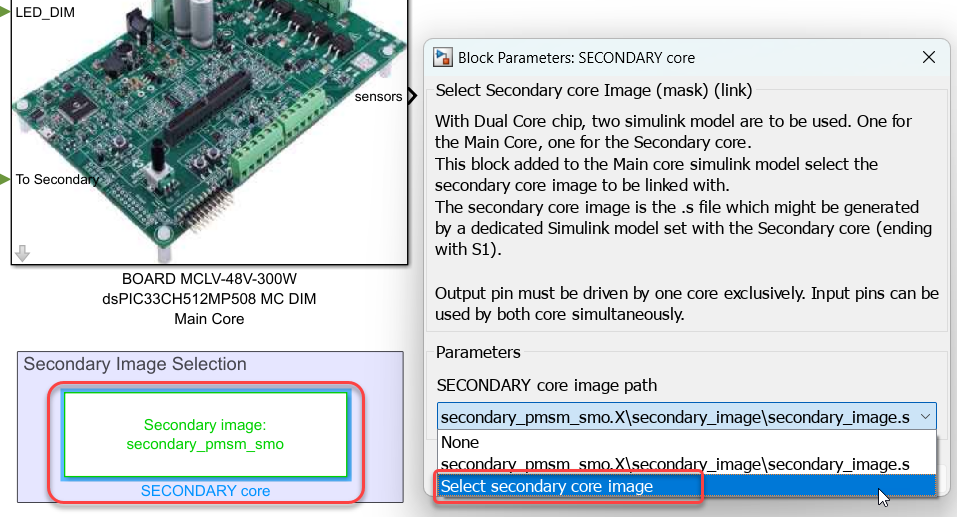

        

    4. 
From this Simulink model an MPLAB X project can be generated. 
To generate the code from the Simulink model, go to the <b>"MICROCHIP"</b> tab, and enable the tabs shown in the figure below. 

        

        

       

    5. 
To generate the code and run the motor, click on <b>‘Build’</b> option under the <b>“Microchip”</b> tab and in <b>'Build, Deploy & Start'</b> drop down. This will generate the MPLAB X project from the Simulink model and program  both the cores of dsPIC33CH512MP508 device.

        

        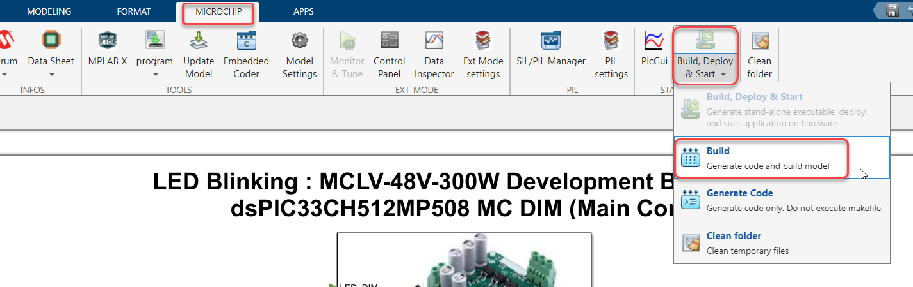

        

    6. 
After completing the process, the <b>‘Operation Succeeded’</b> message will be displayed on the <b>‘Diagnostics Viewer’</b>.

        

       

        

5.	If the device is successfully programmed, <b>LED1 - LD1</b> and <b>LED2 - LD2</b> will be blinking.

6.	To Run the motor, press the push button <b>SW1</b>.

    

      
 
    

7.	The motor speed can be varied using the potentiometer (labeled <b>“POT”</b>). Approximately, after 70% of the full potentiometer value (approximately at 3000 RPM), the motor enters into field weakening region.

    

      

    

13.	Press the push button <b>SW1</b> to stop the motor. Make sure motor is reduced minimum potentimeter value before stopping the motor.

    

      

    

## 5.	DATA VISUALIZATION USING MOTOR CONTROL BLOCKSET (MCB) HOST MODEL

The Sensorless FOC model comes with the initialization required for data visualization using Motor Control Blockset Host Model (MCB Host Model). The MCB Host Model is a Simulink model which facilitates data visualization through the UART Serial Interface. 

1.	
To establish serial communication with the host PC, connect a micro-USB cable between the host PC and the MCLV-48V-300W Development Board (J16 connector). This interface is used for programming as well. 

    

      

    

2. Ensure the sensorless FOC model is programmed and running as described under section ["4. Basic Demonstration"](#4-basic-demonstration) by following steps 1 through 13.

3. 
Open the MCB Host model and double click on the <b>“Serial Setup”</b> block. Then select the appropriate COM port connected to the hardware from the drop-down menu and set the baud rate as 460829. Please note that the same baud rate is required to be chosen in the Sensorless FOC model (the baud rate can be viewed on the <b>“UART Configuration”</b> block inside <b>“MOTOR CONTROL DEVLOPMENT BOARD  Template”</b>).

    

      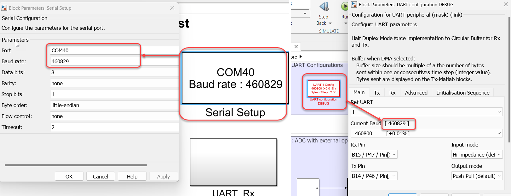

    

4.	
Open the <b>“UART_Rx”</b> subsystem to configure the COM port. This can be done by configuring the <b>“Host Serial Receive”</b> block of the “UART_Rx” subsystem. Ensure to select the same COM port configured in step 3. 

    

      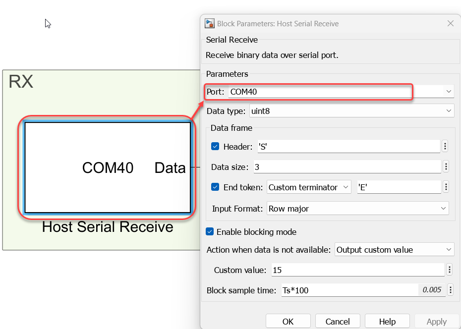

    

5.	
Click the run icon of the MCB Host model to open the scope window and monitor the signals.

    

      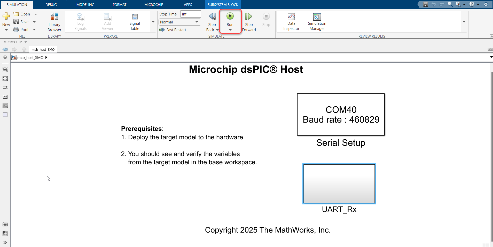

    

6.	
In the figure below, one example is shown where two signals (estimated and reference speeds) have been plotted.

    

      

    

## 	REFERENCES:
For more information, refer to the following documents or links.
1.	AN1078 Application Note “[Sensorless Field Oriented Control of a PMSM](https://www.microchip.com/en-us/application-notes/an1078)”.
2.	MCLV-48V-300W Development Boards User’s Guide  ([DS50003297](https://ww1.microchip.com/downloads/aemDocuments/documents/MCU16/ProductDocuments/UserGuides/Motor-Control-Low-Voltage-48V-300W-Inverter-Board-Users-Guide-DS50003297.pdf)) 
3. dsPIC33CH512MP508 Motor Control DIM Information Sheet ([DS50003069](https://ww1.microchip.com/downloads/aemDocuments/documents/MCU16/ProductDocuments/InformationSheet/dsPIC33CH512MP508-Motor-Control-Dual-In-Line-Module-%28DIM%29-Info-Sheet-DS50003069.pdf))
3. [MPLAB® X IDE installation](https://microchipdeveloper.com/xwiki/bin/view/software-tools/x/install-guide/)
4. [MPLAB® XC-DSC Compiler installation](https://microchipdeveloper.com/xwiki/bin/view/software-tools/xc-dsc/install/)
5.  [Motor Control Blockset](https://in.mathworks.com/help/mcb/)
6.  [MPLAB Device Blocks for Simulink :dsPIC, PIC32 and SAM mcu](https://in.mathworks.com/matlabcentral/fileexchange/71892-mplab-device-blocks-for-simulink-dspic-pic32-and-sam-mcu)
